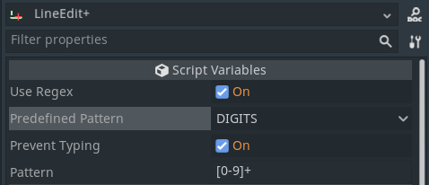
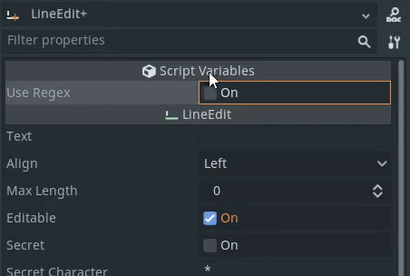
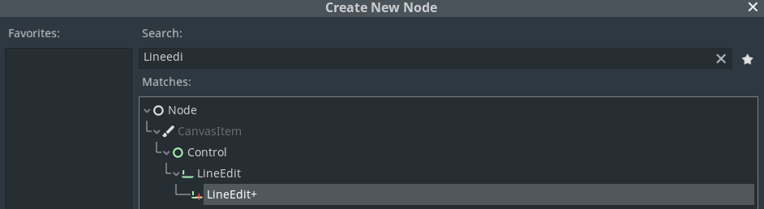

A custom node addon bringing the power of Regex to the LineEdit node.

Made for the [Godot Addon Jam](https://itch.io/jam/godot-addons-jam-1). [Itch page](https://mreliptik.itch.io/lineeditplus)

## Features

Custom node

  

Premade Regex patterns or custom ones

  

  

Example using `run_regex()`, the `regex_result` signal and `prevent_typing` for digits only input

  

## How to use

Tick the `Use Regex` box and choose between a `predefined pattern` or enter your `custom Regex pattern`.

- **Prevent typing**: The lineedit node will automatically remove the characters that are not fitting the pattern
- If not using prevent typing, call `run_regex()` to validate the regex on the text of the lineEdit. Returns true if text match the regex

You can also use the signal `regex_result(result, txt)` to get the result as the user is typing. 

- result is `true` if the Regex matches the text, `fasle otherwise`
- `txt` is the text that matches the Regex

*For example: If you enter a Digits only Regex, all the non digits characters will be removed when the user types them.*

## How to install

Extract the `line_edit_+` folder into the addons folder of you project (create one if needed).

  

Then head to `Project Settings > Plugins` and enable `LineEdit+`. You can now add a new node and select `LineEdit+` instead of LineEdit.

  

## LICENSE

This project is distrbuted as-is, under the MIT license. Check [LICENSE](LICENSE) for more detail.

Made by [MrEliptik](https://twitter.com/mreliptik_) for the [Godot Addon Jam](https://itch.io/jam/godot-addons-jam-1)